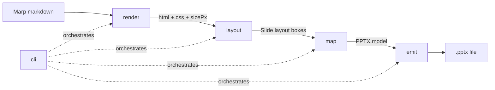

# marp-native-pptx — Design Specification

**Date:** 2026-05-29
**Status:** Approved design, pre-implementation
**Author:** Eugene Kovshilovsky
**Target repo:** new standalone repo at `~/code/marp-native-pptx/` (MIT, npm-publishable). This spec lives in the engagement repo during brainstorming and will be copied into the new repo as its design doc when scaffolding begins.

---

## 1. Problem

Marp's `--pptx-editable` export produces fragmented, overlapping text. The root cause is structural, not a bug we can patch around:

`marp --pptx-editable` renders the deck to **PDF** (Chromium), then runs
`soffice --infilter=impress_pdf_import --convert-to pptx` to turn that PDF back into editable slides. A PDF carries no document structure — it is positioned glyphs. LibreOffice must *reverse-engineer* shapes from glyph positions, and it emits **one floating text frame per styled run**. On any line containing an inline-styled span (e.g. a `<code>` chip with a background), the line shatters into several absolutely-positioned frames whose widths/offsets are LibreOffice's estimates. Those estimates differ from PowerPoint's text engine, so the frames gap, overlap, and bleed.

There are **no hooks** in marp-cli to customize this step (confirmed in `marp-team/marp-cli` `src/converter.ts`). Post-processing the fragmented output (widening or vertically merging boxes — the approach of `marp2pptx` on PyPI and the community python-pptx "box-widening" script) cannot fix *horizontal* same-line fragmentation and can worsen it.

The only way to remove the fragmentation — and the standing "not pixel-perfect" warning's *fragmentation* cause — is to **never go through PDF**: read the live, rendered DOM (which still knows "this is `<code>` with a pink background") and emit native PowerPoint shapes directly.

## 2. Goals & non-goals

**Goals**
- A standalone, MIT-licensed, npm-publishable CLI + library that converts a Marp Markdown deck to an **editable** `.pptx` with **no fragmentation or overlap**.
- **General Marp coverage**: works with arbitrary themes/CSS and `html: true` content, not just one deck.
- Uses the *same* rendering engine as Marp (`@marp-team/marp-core`) so output matches Marp's own preview, then replaces only the lossy converter.
- Drop-in CLI flags mirroring marp-cli (`-o`, `--theme-set`, `--allow-local-files`).
- Text is always **native and editable**; graceful degradation for un-expressible decoration.

**Non-goals (v1)**
- Pixel-identical output. No editable format can guarantee this — PowerPoint re-flows text with its own engine. We eliminate fragmentation/overlap and match positions/styles closely; exact wrapping is best-effort. (Pixel-identical is what image-mode PPTX is for; that path remains available and unchanged.)
- Font *embedding* (pptxgenjs cannot embed fonts; we set explicit `fontFace` and document substitution).
- Presenter notes, animations/builds, slide transitions.
- Being a literal plugin to marp-cli (no seam exists; we are a sibling tool).

**Success criteria**
- For a deck exercising headings, lists, tables, inline code chips, code blocks, images, gradient section-dividers, multi-column, and `html:true`: the produced `.pptx` opens in PowerPoint with (a) every inline code chip as **one run with a fill** inside its paragraph, (b) **exactly one text box per block-level text element** (asserted on the XML — fragmentation structurally absent), (c) no overlapping/out-of-bounds shapes per the self-check, (d) visual diff against Marp's PNG export under threshold.

## 3. Architecture

Five small units, each with one job and a clean interface. The `map` unit is a pure function (no I/O, no browser) — most logic lives there and is testable in isolation.



| Unit | Input → Output | Responsibility |
|---|---|---|
| `render` | `markdown`, `RenderOptions` → `RenderResult { html, css, sizePx }` | Drive `@marp-team/marp-core` to produce slide HTML + theme CSS. Resolve theme set. No browser. |
| `layout` | `RenderResult` → `SlideLayout[]` | Headless Chromium (puppeteer-core). Measure the rendered DOM; emit normalized **layout boxes** with geometry + computed style + segmented text runs. |
| `map` | `SlideLayout[]`, `MapOptions` → `PptxModel` | **Pure.** Convert px→pt/inches, CSS→shape options, decide native-vs-rasterize. Backend-agnostic model. |
| `emit` | `PptxModel`, raster assets → `.pptx` | `pptxgenjs` builds native shapes/tables/pictures and writes the file. |
| `cli` | argv → exit code | Parse flags, orchestrate the pipeline, print warnings summary. |

**Data flow:** `md → render(html) → layout(boxes) → map(model) → emit(pptx)`.

### 3.1 Core data types (sketch)

```ts
interface RenderResult { html: string; css: string; sizePx: { w: number; h: number }; slideCount: number }

interface RunStyle {
  fontFace: string; sizePt: number; bold: boolean; italic: boolean;
  color: string;                 // hex, no '#'
  fill?: string;                 // run background (the code-chip pink), hex or undefined
  underline?: boolean; strike?: boolean;
}
interface Run { text: string; style: RunStyle }
interface Paragraph { runs: Run[]; align: 'left'|'center'|'right'|'justify'; lineSpacingPt: number; bullet?: BulletSpec }

interface Rect { xPx: number; yPx: number; wPx: number; hPx: number }   // relative to slide origin

type LayoutBox =
  | { kind: 'text';  rect: Rect; paras: Paragraph[]; valign: 'top'|'middle'|'bottom' }
  | { kind: 'image'; rect: Rect; src: string }
  | { kind: 'shape'; rect: Rect; fill?: string; line?: LineSpec; radiusPx?: number }
  | { kind: 'table'; rect: Rect; rows: TableCell[][] }
  | { kind: 'raster'; rect: Rect; pngPath: string };   // rasterized decoration fallback

interface SlideLayout { boxes: LayoutBox[]; background?: { fill?: string; rasterPng?: string } }
```

The `PptxModel` is the same shape expressed in PPTX units (inches/points) and pptxgenjs-ready options; `map` is the translation between them.

## 4. Text measurement & sizing  *(the crux — we read, we don't compute)*

The decisive design principle: **we never compute font metrics or line-breaking ourselves.** Chromium has *already* laid out the themed text after applying the theme's CSS. Our job is to read that result, not reproduce it. This is exactly what makes the approach robust where heuristic post-processors fail.

For each block-level text element (`h1`–`h6`, `p`, `li`, `td`, `blockquote`, `figcaption`, …):

1. **Position & size of the box** — `el.getBoundingClientRect()` gives `(x, y, width, height)` in CSS px. We subtract the slide section's origin so coordinates are slide-relative. The PPTX text box is placed at exactly this rect. Because *every* block is placed by its own measured rect, vertical relationships ("the space under a heading") are preserved **by construction** — we never stack boxes with guessed gaps, which is precisely the failure mode of the LibreOffice/post-processor path. Boxes don't overlap because the browser didn't overlap them.

2. **Font size** — read computed `font-size` in px per run; convert `pt = px × 0.75` (CSS px→pt at 96 dpi). A theme that sets 16 pt renders as 21.33 px; ×0.75 recovers 16 pt. No guessing — we recover the theme's intended point size from what it actually rendered.

3. **Line spacing** — read computed `line-height` in px; set the paragraph `lineSpacing` in points (`px × 0.75`). This makes a box that wraps to N lines occupy the same vertical rhythm PowerPoint-side.

4. **Run segmentation** — depth-first walk of the element's inline descendants with a style stack. Each text node emits a `Run { text, style }` where `style` is resolved from its nearest element via `getComputedStyle` (font-family/size/weight/style, color, `background-color`, text-decoration). Adjacent runs with identical resolved style merge. This yields the paragraph's run array directly consumable by `pptxgenjs.addText([{text, options}…])`. **An inline `<code>` is just a run whose style has `fill` set and a monospace `fontFace`** — one run, inside the one paragraph box. Fragmentation is therefore *structurally impossible*, not "fixed."

5. **Font face** — computed `font-family` is a CSS stack (`"Roboto", sans-serif`); take the first concrete family as `fontFace`. Document that fonts not installed in PowerPoint substitute (inherent caveat).

6. **Internal box insets** — set to 0 and `wordWrap: true`, `autoFit: none`. We own the box width from the measured rect, so PowerPoint's job is only to flow the same runs into the same width.

7. **Wrapping fidelity (best-effort, documented)** — we do **not** hard-insert line breaks. We hand PowerPoint the same width + font sizes + faces, so its layout reproduces the wrapping closely. As a refinement, `layout` may capture per-line boxes via `Range.getClientRects()`; if a measured line would overflow the box at the chosen width, `map` widens the box by a small epsilon (we control width) rather than letting PowerPoint wrap differently. Default behavior trusts the measured width; the per-line refinement is a guarded enhancement, not required for v1 correctness.

## 5. DOM→PPTX mapping rules

Governing rule: **text is always native/editable; only decoration PPTX can't express natively is rasterized.**

**Native text & structure**
- Block text element → one `text` box (§4).
- Inline runs → pptxgenjs run options. `strong`→bold, `em`→italic, `a`→color+underline, `code`→fill+mono, `s`/`del`→strike.
- Lists → one box per `<li>` (or one multi-paragraph box per list) with `bullet` from the marker; nesting via `indentLevel` from DOM depth.
- Tables → native pptx `addTable` with per-cell runs, fills, and borders from computed style.
- Alignment/vertical-align from computed `text-align` / flex placement.

**Native decoration (when expressible)**
- Solid `background-color` → shape `fill`.
- `border` (uniform) → shape `line`; `border-radius` → rounded-rect approximation.

**Rasterization escape hatch (general coverage without infinite CSS mapping)**
- Any element whose visual cannot be faithfully expressed natively — **gradients, `box-shadow`, `transform`, `background-image`, `::before/::after`, inline SVG, filters, arbitrary `html:true` blobs** — is **rasterized as a single PNG of just that element** (puppeteer `element.screenshot()` at device-scale ≥2) and placed as a `raster` box at its rect. Text rendered *on top* of such decoration remains a separate native/editable text box. So a gradient section-divider becomes a full-bleed background image with the title still editable.
- Decision is per-element and explicit: `map` inspects the captured style and routes to native or raster. Unknown/unsupported constructs **degrade to a faithful image**, never a crash or a mangled shape.

**Images** (``, including pre-rendered mermaid/quadrant PNGs) → `image` box by rect, aspect preserved.

**Slide background** → solid fill if simple; else a full-bleed raster.

## 6. Coordinate & unit conversion

- Read the actual rendered slide pixel size from the section element (robust across themes/sizes) → `sizePx`.
- pptxgenjs slide is defined in inches; for 16:9 use `13.333 × 7.5 in`. `scaleX = slideInchesW / sizePx.w`, `scaleY = slideInchesH / sizePx.h`.
- Position/size: `inches = px × scale`. Font/line: `pt = px × 0.75` (independent of slide scaling — points are absolute). Internally we may use EMU (`1 in = 914400 EMU`) for precision; pptxgenjs accepts inches.

## 7. Error handling (no silent failures)

- **Browser discovery** honors `PUPPETEER_EXECUTABLE_PATH` / `CHROME_PATH`, reuses the Chromium Marp already downloads, and on Linux passes `--no-sandbox` when `CHROME_NO_SANDBOX=1` (matches the engagement VM). Missing browser → explicit, actionable error.
- **Per-node extraction is wrapped**: a node that fails to map is logged and skipped, counted in an end-of-run **warnings summary** (`⚠ 3 elements rasterized as fallback · 0 nodes dropped`). Never a silent drop; never a whole-deck crash from one node.
- **Model self-check** before emit: warn if two text boxes overlap beyond a small tolerance, or any shape exceeds slide bounds — catches layout-extraction regressions early.
- **Honest limitations surfaced in README**: no font embedding (substitution possible); best-effort wrapping; rasterized decoration is not re-editable (but its text overlay is).

## 8. Testing strategy (layered; fast pure core)

- **Unit — `map` (no browser):** layout-box fixtures → assert exact `PptxModel`. Most logic, most bugs, fastest tests.
- **Layout (headless browser):** one tiny fixture deck per feature (headings, lists, table, inline-code, code-block, image, gradient divider, multi-column, `html:true`) → assert extracted geometry within tolerance and correct run segmentation.
- **Integration:** build a `.pptx`, unzip, assert the DrawingML XML has the expected structure — specifically **one `<p:sp>` text box per paragraph** and the code chip as **one `<a:r>` run with a fill** (fragmentation asserted *absent*).
- **Visual regression:** render the produced `.pptx` to PNG via LibreOffice (used **only in tests**, never in the tool) and image-diff against Marp's own PNG export within a threshold; flag gross drift.

## 9. Packaging

- New git repo `~/code/marp-native-pptx/`, MIT. No imports from / no history shared with the engagement repo.
- TypeScript, ESM. Deps: `@marp-team/marp-core`, `puppeteer-core`, `pptxgenjs`. Dev: a test runner (vitest), an XML/zip reader for assertions, an image-diff lib, LibreOffice (test-only).
- `bin`: `marp-native-pptx`. Library entry exports `render`, `layout`, `map`, `emit`, and a `convert()` convenience.
- The engagement repo's `build.sh` calls the published/linked CLI once ready; nothing in the engagement repo depends on its internals.

## 10. CLI

```
marp-native-pptx <input.md> -o <output.pptx>
    [--theme-set <dir...>] [--allow-local-files]
    [--debug]        keep intermediate HTML + raster PNGs
    [--check]        run the model self-check and report (non-zero on hard errors)
```

Flag names mirror marp-cli so it is a drop-in substitution in existing scripts.

## 11. Risks & open questions

- **Wrapping drift** in PowerPoint vs Chrome — mitigated by matching width/size/face and the optional per-line refinement; accepted as a documented non-goal for pixel-identity.
- **Run segmentation across wrapped lines** — a single run that wraps must stay one run with the box wrapping it; verified by the inline-code and long-paragraph fixtures.
- **Table sizing** — native pptx tables auto-size rows; we set column widths from measured cell rects and accept minor row-height differences.
- **`html:true` arbitrary content** — covered by the rasterization fallback; truly interactive/script content is out of scope.
- **Font availability** — substitution documented; future enhancement could warn per-deck which fonts are non-standard.

## 12. Future (post-v1)

- Per-line wrapping refinement on by default if it proves stable.
- Optional font-embedding via a lower-level OOXML writer if pptxgenjs gains support.
- Speaker notes; basic transitions.
- Propose the approach upstream to marp-team as an alternative converter.
